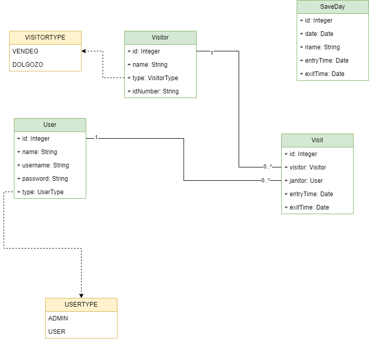

# Model Csomag

Ez a csomag tartalmazza az adatbázis-entitásokat reprezentáló osztályokat.

---

### Model java csomagok részletesen:

#### [Reason](reason.md)  
#### [Users](users.md)  
#### [Visit](visit.md)  
#### [Visitor](visitor.md)  

---

## UserType.java

Ez az enum reprezentálja a felhasználó típusait az alkalmazásban. Az enum értékei: 
* ADMIN
* USER

---

## VisitorType.java

Ez az enum reprezentálja a látogató típusait az alkalmazásban. Az enum értékei:
* VENDEG
* DOLGOZO

---