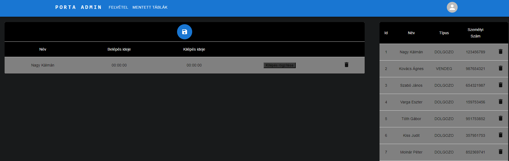
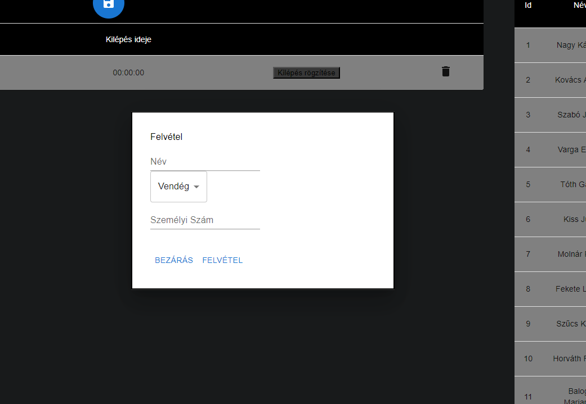
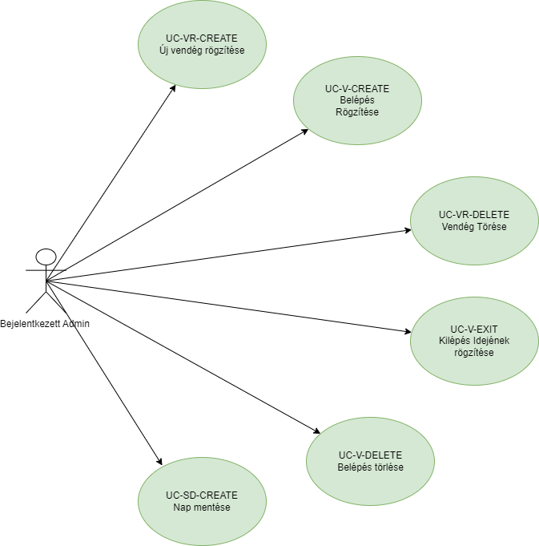

# Admin kezelése - funkcionális modell:

## Általános leírás:

Alapfunkciók: A admin bejelentkezése után, itt lehet be és kiléptetni a dolgozókat,
illetve vendégeket és dolgozókat is felvenni, törölni az adatbázisból. 

## Felületi terv:

### Admin oldal felülete

#### Arculat

#### A felületen lévő mezők (Felvétel gomb megnyomásakor)

| Mező neve      |     Típusa      | Szerkeszthető | Kötelező |
|:---------------|:---------------:|:-------------:|:--------:|
| Név            | Szöveges input  |       I       |    I     |
| Személy típusa | Legördülő lista |       I       |    I     |
| Személyiszám   | Szöveges input  |       I       |    I     |

#### A felületen elérhető műveletek

| Funkció                                                                 |                                                                                                            Esemény                                                                                                            |                           Megjegyzés |
|:------------------------------------------------------------------------|:-----------------------------------------------------------------------------------------------------------------------------------------------------------------------------------------------------------------------------:|-------------------------------------:|
| Felvétel gombra kattintás                                               |  Végrehajtásra került az [UC_VR_CREATE](visitor_usecases.md) használati eset, a frontenden megjenelik egy "Modal" amiben az adatok megadása után a jobb oldali táblában megjelennek az adatok és innentő lehet ezt kezelni.   | Az admin tud dolgozókat is felvenni. |
| Egy személy nevére kattintás                                            | Végrehajtásra került az [UC_V_CREATE](visit_usecases.md) használati eset, az adott személy megjelenik a bal oldali "Belépett emberek" táblában, megjeleníti a táblában az ember nevét, belépési idejét és egy kilépés gombot. |                                    - |
| Egy személy neve melleti "kuka" ikonra kattintás a jobb oldali táblában |                                Végrehajtásra került az [UC_VR_DELETE](visitor_usecases.md) használati eset, az adott személy törődik a jobb oldali "Látogatói" táblázatból, de újra felvehető.                                | Ezt csak az admin tudja végrehajtani |
| "Kilépés rögzítése" gombra kattintás                                    |                                      Végrehajtásra került az [UC_V_EXIT](visit_usecases.md) használati eset, a táblázatban megjelenik a kilépés ideje ami az adott személyre vonatkozik.                                      |                                    - |
| Egy személy neve melleti "kuka" ikonra kattintás a bal oldali táblában  |                                 Végrehajtásra került az [UC_V_DELETE](visit_usecases.md) használati eset, az adott személy törődik a jobb oldali "Látogatói" táblázatból, de újra felvehető.                                  | Ezt csak az admin tudja végrehajtani |
| "Mentés" gombra kattintás                                               |              Végrehajtásra került az [UC_SD_CREATE](saveday_usecases.md) és a [UC_V_DeleteAll](visit_usecases.md) használati esetek, az adott nap belépései elmentődnek és a bal oldali belépési tábla üres lesz              |                                    - |