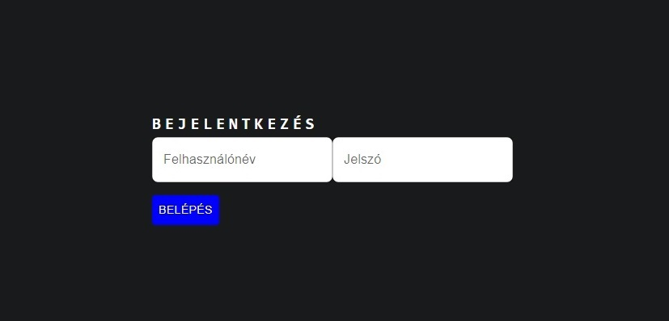

# Bejelentkezés kezelése - funkcionális modell:

## Általános leírás:

Alapfunkciók: A felhasználó bejelentkeztetése, illetve a megfelelő oldalra való átírányítás 

## Felületi terv:

### Bejelentkező felület

#### Arculat

#### A felületen lévő mezők

| Mező neve        |     Típusa     | Szerkeszthető | Kötelező |
|:-----------------|:--------------:|:-------------:|:--------:|
| Felhasználónév   | Szöveges input |       I       |    I     |
| Jelszó           | Szöveges input |       I       |    I     |

#### A felületen elérhető műveletek

| Funkció                  |                                                                                           Esemény                                                                                           | Megjegyzés |
|:-------------------------|:-------------------------------------------------------------------------------------------------------------------------------------------------------------------------------------------:|-----------:|
| Belépés gombra kattintás | Végrehajtásra került az [UC-U-LOGIN](user_usecases.md), Felhasználó bejelentkezése használati eset. A frontend a felhasználó típusa szerint (Admin vagy portás) a megfelelő oldalra navigál |          - |            |

