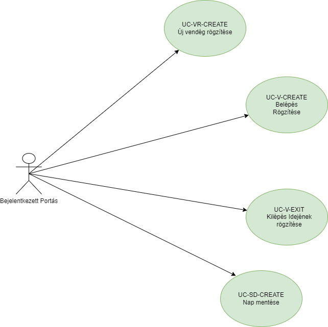

# Portás kezelése - funkcionális modell:

## Általános leírás:

Alapfunkciók: A portás(User) bejelentkezése után, itt lehet be és kiléptetni a dolgozókat,
illetve vendégeket felvenni. 

## Felületi terv:

### Portás oldal felülete

#### Arculat

#### A felületen lévő mezők

| Mező neve      |     Típusa      | Szerkeszthető | Kötelező |
|:---------------|:---------------:|:-------------:|:--------:|
| Név            | Szöveges input  |       I       |    I     |
| Személy típusa | Legördülő lista |       N       |    I     |
| Személyiszám   | Szöveges input  |       I       |    I     |

#### A felületen elérhető műveletek

| Funkció                      |                                                                                                            Esemény                                                                                                            |                            Megjegyzés |
|:-----------------------------|:-----------------------------------------------------------------------------------------------------------------------------------------------------------------------------------------------------------------------------:|--------------------------------------:|
| Felvétel gombra kattintás    |  Végrehajtásra került az [UC-VR-CREATE](visitor_usecases.md) használati eset, a frontenden megjenelik egy "Modal" amiben az adatok megadása után a jobb oldali táblában megjelennek az adatok és innentő lehet ezt kezelni.   | A portás csak vendégeket tud felvenni |
| Egy személy nevére kattintás | Végrehajtásra került az [UC-V-CREATE](visit_usecases.md) használati eset, az adott személy megjelenik a bal oldali "Belépett emberek" táblában, megjeleníti a táblában az ember nevét, belépési idejét és egy kilépés gombot. |                                     - |
| Kilépés gombra kattintás     |                                     Végrehajtásra került az [UC-V-EXIT](visitor_usecases.md) használati eset, a táblázatban megjelenik a kilépés ideje ami az adott személyre vonatkozik.                                     |                                     - |
| "Mentés" gombra kattintás    |              Végrehajtásra került az [UC-SD-CREATE](saveday_usecases.md) és a [UC-V-DeleteAll](visit_usecases.md) használati esetek, az adott nap belépései elmentődnek és a bal oldali belépési tábla üres lesz              |                                     - |