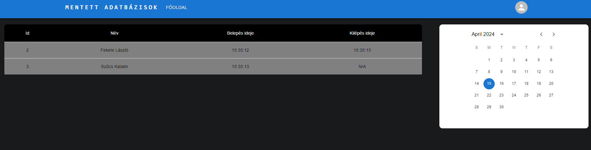
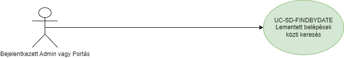

# Mentett napok kezelése - funkcionális modell:

## Általános leírás:

Alapfunkciók: A portás(User) vagy admin bejelentkezése után, itt lehet visszanézni a korábbi napok belépéseit. 

## Felületi terv:

### Mentett táblák (napok) felület

#### Arculat

#### A felületen lévő mezők

| Mező neve         |          Típusa           | Szerkeszthető | Kötelező |
|:------------------|:-------------------------:|:-------------:|:--------:|
| Dátum kiválasztás | Date input "Calendar"-ból |       I       |    I     |

#### A felületen elérhető művelet

| Funkció                         |                                                                                      Esemény                                                                                      | Megjegyzés |
|:--------------------------------|:---------------------------------------------------------------------------------------------------------------------------------------------------------------------------------:|-----------:|
| Egy napra kattintás a naptárban | Végrehajtásra került az [UC-SD-FINDBYDATE](saveday_usecases.md) használati eset, A rendszer visszakeresi az adott nap összes belépését és a táblázatban megjelennek egymás alatt. |          - |
